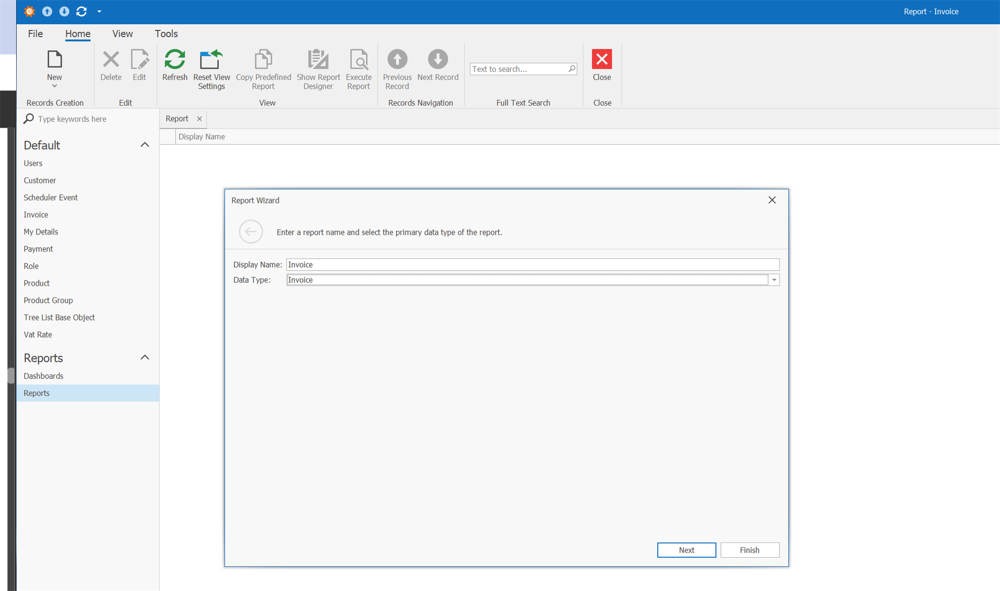

# eXpressApp Framework przyjacielem programisty

Proces tworzenia  oprogramowania składa się z różnych etapów, z których niektóre potrafimy robić dniami i nocami np. 3 doby na pizzy i redbulu, oraz takie które odkładamy jak się da i najchętniej delegujemy junior programmer’owi. W efekcie powstają smutne historie i w kolejnej firmie już nasz były junior, opowiada, że zajmował się cały czas np. nudnymi CRUD’ami, układał edytory na widokach albo czymś jeszcze nudniejszym. 

Standardowy proces tworzenia oprogramowania stawia przed programistami następujące wyzwania:
*	 Najprostsze czynności jak przeglądanie czy przechowywanie danych są czasochłonne. Programiści muszą dbać o każdy aspekt tworzonej aplikacji – od zarządzania danymi na poziomie serwerów danych, po dostarczenie edytorów do każdego edytowanego pola.
*	Im bardziej złożony system, tym więcej kodu, tym więcej nieuchronnych błędów. Do celów testowych potrzeba znaczną ilość czasu i zasobów ludzkich.
*	Utrzymanie tak stworzonego systemu nie jest trywialne. Nawet trzymając się wszelkich zasad programowania, wiele zadań będzie wymagało modyfikacji aplikacji w wielu miejscach. Jej rozbudowa jest kosztowna i koszt ten rośnie wraz ze złożonością systemu.
Oczywiście niniejsze podejście ma tez swoje zalety:
*	Każdy aspekt powstającego sytemu jest w pełni kontrolowany przez programistów. Nie są uzależnieni od ograniczeń czy nawet błędów zewnętrznych bibliotek. Wszystko co stworzyli mogą modyfikować i poprawiać w prostszy sposób.
*	Programiści mogą optymalizować system wg własnych potrzeb, co jest trudne do osiągnięcia bazując na zewnętrznych rozwiązaniach.
*	Aplikacje nie muszą być tworzone wg zasad wymaganych przez zewnętrzne narzędzia/biblioteki.

Niekiedy powyższe rozwiązanie jest jedynym wyjściem aby stworzyć właściwy system, często jednak wykonujemy systemy w których pewne funkcjonalności powtarzają się i faktycznie robienie tego samego w kółko zaczyna być nużące.

Od lat powstają narzędzia, które próbują wyeliminować powtarzalne elementy systemu, które prawie zawsze robi się w podobny sposób niezależnie od tego czy jest to aplikacja do wystawiania faktur, czy program do diagnozowania i leczenia raka. Narzędzia tego typu zwane kiedyś RAD (Rapid Application Development) np. Power Builder, Clarion, Power Apps i wiele innych, w różnym stopniu pozwalały programistom na elastyczność podczas procesu tworzenia aplikacji. Jedne wymagały trzymania się konkretnych zasad i pozwalały na tworzenie aplikacji o dość ograniczonej funkcjonalności, inne pozwalały na większa elastyczność, nie mniej jednak bardzo często kończyło się na egzotycznych trikach by osiągnąć zamierzony cel. O skuteczności tych narzędzi świadczą systemy jakie powstały choćby w Polsce m.in. cała seria WaPro WF-MAG (KaPer,Gang,Fakir) czy Comarch ERP XL stworzone z wykorzystaniem Clarion’a, czy produkty rodziny Simple.ERP, tworzone za pomocą Power Builder’a i wiele innych. 
Z czasem narzędzia te zaczęły tracić przewagę z powodu rozwoju języków obiektowych i pojawiania się bibliotek wspomagających programistów w każdym możliwym aspekcie ich pracy.

Jednym z takich jest Devexpress eXpressApp Framework (XAF). (Niestety nie jest to narzędzie darmowe, ale dostępna jest wersja testowa, a efekt końcowy jest wart ceny licencji - w końcu to jedynie  miesięczna pensja junior developera).

XAF opiera się na architekturze MVC. Dane przechowujemy w bazie danych np. MS SQL (XAF wspiera kilkanaście serwerów baz danych ). Komunikacja z baza danych jest poprzez ORM (XPO lub Entity Framework Core). ORM służy do mapowania struktur tabel bazy danych na klasy w modelu aplikacji. Zadeklarowane klasy modelujące naszą dziedzinę biznesową automatycznie są konwertowane na Widoki (ListView, DetailView) , które pozwalają na dodawanie, modyfikację czy przeglądanie danych (nudne CRUD’y poszły się …).

**ListView** wyświetlają  kolekcje danych, pozwalają je sortować i przeszukiwać z wykorzystaniem zaawansowanych metod filtrowania.

**DetailView** pozwalają na prace z pojedynczym obiektem (rekordem danych) wyświetlając dane w odpowiednich edytorach. Wykorzystywane są do dodawania i edycji danych.
DashboardView pozwala grupować wiele innych widoków na jednym oknie.

#### Klasa Biznesowa

Model biznesowy definiujemy za pomocą klas, dla których zostaną utworzone struktury tabel i relacji w bazie danych i jednocześnie zostaną utworzone widoki używane w interfejsie aplikacji.


#### Kontrolery


#### Model


#### Bierzemy się za program

W skrócie: należy zdefiniować klasy, które odzwierciedlą tabele bazy danych używane przez nasza aplikację. Uzupełnić je o powiązania pomiędzy nimi w celu zamodelowania relacji. 
Opcjonalnie dodać kilka kontrolerów i akcji np do weryfikacji klienta w US/GUS. Zmodyfikować w modelu domyślne widoki wg naszych upodobań - w końcu nie każdemu będzie się podobało to co domyślnie zaproponuje XAF.

Klasy możemy stworzyć na 3 sposoby:
1.	Model First - Definiując klasy i powiązania w dedykowanym Edytorze Modelu (XPO Data Model Designer) i generując klasy na podstawie tego modelu.
2.	Database First – importując struktury z istniejącej bazy danych do Edytora Modelu i następnie wygenerowanie klas.
3.	Code First – Deklarując klasy bezpośrednio w kodzie.
Osobiście preferuję wariant 3-ci – czyli klasy definiowane bezpośrednio w kodzie.

Potrzebujemy następujące klasy i ich pola:


##### Klient
```csharp
 [DefaultClassOptions]
    public class Customer : BaseObject
    {
        public Customer(Session session) : base(session)
        { }


        Segment segment;
        string notes;
        string postalCode;
        string city;
        string street;
        string customerName;
        string vatNumber;
        string symbol;

        [Size(SizeAttribute.DefaultStringMappingFieldSize)]
        public string Symbol
        {
            get => symbol;
            set => SetPropertyValue(nameof(Symbol), ref symbol, value);
        }

        [Size(SizeAttribute.DefaultStringMappingFieldSize)]
        public string VatNumber
        {
            get => vatNumber;
            set => SetPropertyValue(nameof(VatNumber), ref vatNumber, value);
        }


        [Size(SizeAttribute.DefaultStringMappingFieldSize)]
        public string CustomerName
        {
            get => customerName;
            set => SetPropertyValue(nameof(CustomerName), ref customerName, value);
        }


        [Size(SizeAttribute.DefaultStringMappingFieldSize)]
        public string Street
        {
            get => street;
            set => SetPropertyValue(nameof(Street), ref street, value);
        }


        [Size(SizeAttribute.DefaultStringMappingFieldSize)]
        public string City
        {
            get => city;
            set => SetPropertyValue(nameof(City), ref city, value);
        }

        [Size(SizeAttribute.DefaultStringMappingFieldSize)]
        public string PostalCode
        {
            get => postalCode;
            set => SetPropertyValue(nameof(PostalCode), ref postalCode, value);
        }


        
        public Segment Segment
        {
            get => segment;
            set => SetPropertyValue(nameof(Segment), ref segment, value);
        }

        [Association]
        public XPCollection<Invoice> Invoices
        {
            get
            {
                return GetCollection<Invoice>(nameof(Invoices));
            }
        }

        
        [Size(SizeAttribute.Unlimited)]
        public string Notes
        {
            get => notes;
            set => SetPropertyValue(nameof(Notes), ref notes, value);
        }

    }

    public enum Segment
    { 
        
        Corporate= 2,
        Consumer = 7,
        [XafDisplayName("Home Office")]
        HomeOffice = 0,
        [XafDisplayName("Small Business")]
        SmallBusiness =9
    }
```

W przypadku typów wyliczeniowych możemy wymusić aby XAF wyświetlał inne opisy niż wynika z nazw poszczególnych wartości typu.

##### Produkt

```csharp
[DefaultClassOptions]
public class Product : BaseObject
{
    public Product(Session session) : base(session)
    { }


    string notes;
    string gTIN;
    string productName;
    string symbol;

    [Size(SizeAttribute.DefaultStringMappingFieldSize)]
    public string Symbol
    {
        get => symbol;
        set => SetPropertyValue(nameof(Symbol), ref symbol, value);
    }


    [Size(SizeAttribute.DefaultStringMappingFieldSize)]
    public string ProductName
    {
        get => productName;
        set => SetPropertyValue(nameof(ProductName), ref productName, value);
    }


    [Size(SizeAttribute.DefaultStringMappingFieldSize)]
    public string GTIN
    {
        get => gTIN;
        set => SetPropertyValue(nameof(GTIN), ref gTIN, value);
    }

    
    [Size(SizeAttribute.Unlimited)]
    public string Notes
    {
        get => notes;
        set => SetPropertyValue(nameof(Notes), ref notes, value);
    }

}
```

##### Faktura

```csharp
[DefaultClassOptions]
   public class Invoice : BaseObject
   {
       public Invoice(Session session) : base(session)
       { }


       string notes;
       decimal brutto;
       decimal vat;
       decimal netto;
       Customer customer;
       DateTime dueDate;
       DateTime invoiceDate;
       string invoiceNumber;

       [Size(SizeAttribute.DefaultStringMappingFieldSize)]
       public string InvoiceNumber
       {
           get => invoiceNumber;
           set => SetPropertyValue(nameof(InvoiceNumber), ref invoiceNumber, value);
       }


       public DateTime InvoiceDate
       {
           get => invoiceDate;
           set => SetPropertyValue(nameof(InvoiceDate), ref invoiceDate, value);
       }


       public DateTime DueDate
       {
           get => dueDate;
           set => SetPropertyValue(nameof(DueDate), ref dueDate, value);
       }


       public Customer Customer
       {
           get => customer;
           set => SetPropertyValue(nameof(Customer), ref customer, value);
       }


       public decimal Netto
       {
           get => netto;
           set => SetPropertyValue(nameof(Netto), ref netto, value);
       }


       public decimal Vat
       {
           get => vat;
           set => SetPropertyValue(nameof(Vat), ref vat, value);
       }


       public decimal Brutto
       {
           get => brutto;
           set => SetPropertyValue(nameof(Brutto), ref brutto, value);
       }

       
       [Size(SizeAttribute.Unlimited)]
       public string Notes
       {
           get => notes;
           set => SetPropertyValue(nameof(Notes), ref notes, value);
       }
   }
   
   
     public class InvoiceItem : BaseObject
    {
        public InvoiceItem(Session session) : base(session)
        { }


        Invoice invoice;
        decimal brutto;
        decimal vat;
        decimal netto;
        decimal unitPrice;
        decimal quantity;
        Product product;

        public Product Product
        {
            get => product;
            set => SetPropertyValue(nameof(Product), ref product, value);
        }


        [Association]
        public Invoice Invoice
        {
            get => invoice;
            set => SetPropertyValue(nameof(Invoice), ref invoice, value);
        }

        public decimal Quantity
        {
            get => quantity;
            set => SetPropertyValue(nameof(Quantity), ref quantity, value);
        }


        public decimal UnitPrice
        {
            get => unitPrice;
            set => SetPropertyValue(nameof(UnitPrice), ref unitPrice, value);
        }


        public decimal Netto
        {
            get => netto;
            set => SetPropertyValue(nameof(Netto), ref netto, value);
        }

        public decimal Vat
        {
            get => vat;
            set => SetPropertyValue(nameof(Vat), ref vat, value);
        }

        
        public decimal Brutto
        {
            get => brutto;
            set => SetPropertyValue(nameof(Brutto), ref brutto, value);
        }

    }
```


#### Relacje

XPO wspiera 3 typy relacji pomiędzy obiektami: 
*	jeden do wielu 1-M
*	Jeden do Jednego 1-1
*	Wiele do Wielu M-M

W naszym przypadku mamy do czynienia z następującymi relacjami:

* Klient może mieć dowolną liczbę faktur 1-M
* Faktura ma co najmniej jedna pozycję 1-M
* Każda pozycja jest w relacji do Produktu. (Produkt może być na wielu pozycjach) 1-N.
* Produkt może należeć do wielu grup M-M

W fakturze do pola Customer dodajemy adnotację Association (aby wskazać ze po tej kolumnie jest powiązanie do kolekcji faktur w kliencie) oraz dodajemy kolekcję Pozycji faktury i oznaczamy je odpowiednimi adnotacjami:


### Faktury klienta
```csharp
[Association]
public Customer Customer
{
    get => customer;
    set => SetPropertyValue(nameof(Customer), ref customer, value);
}

...

W klasie klienta dodajemy kolekcję do wyświetlania listy faktur

```csharp


[Association,Aggregated]
public XPCollection<Invoice> Invoices
{
    get
    {
        return GetCollection<Invoice>(nameof(Invoices));
    }
}
```

### Pozycje faktury


A w pozycji dodajemy powiązanie do faktury:

```csharp
[Association]
public Invoice Invoice
{
    get => invoice;
    set => SetPropertyValue(nameof(Invoice), ref invoice, value);
}
```
W fakturze kolekcję pozycji:

```csharp
  [Association, DevExpress.Xpo.Aggregated]
public XPCollection<InvoiceItem> Items
{
    get
    {
        return GetCollection<InvoiceItem>(nameof(Items));
    }
}
```

Kompilujemy i uruchamiamy program. Do dyspozycji mamy wersje WinForms lub Blazor. W zależności od tego co wybierzemy naszym oczom pojawi się wersja Windowsowa:


Jak widać dostajemy z automatu możliwość prostego wyszukiwania w liście w sposób znany choćby z programu Excel. Jak i bardzie zaawansowany edytor filtrów:


lub Webowa:


Na powyższym zdjęciu widać ze musimy dopieścić formatowanie liczb i wyliczanie wartości pozycji i kompletnej faktury.
Dlatego w pozycji faktury dodamy metodę, która pozwoli nam na wyliczenie wartości faktury, następnie na poziomie faktury dodamy kod, który będzie sumował pozycje. Tu pojawia się dylemat architektoniczny, który zawsze trzeba przeanalizować - czy chcemy dane wyliczać za każdym razem gdy potrzebna nam jest ta informacja, czy zapamiętywać w bazie danych. Zapamiętywanie danych w bazie danych ma więcej zalet niż wad - najistotniejsze jest to, że przy większej ilości danych jest szybciej. Dlatego tutaj też zastosujemy to rozwiązanie.

W pierwszej kolejności metoda wyliczająca netto, Vat i brutto po wpisaniu ilości.
Żeby liczyć Vat, musimy uzupełnić aplikację o stawki Vat, wiec dodajemy nowa klasę: VatRate:

```csharp
[DefaultClassOptions]
public class VatRate : XPLiteObject
{
    public VatRate(Session session) : base(session)
    { }


    decimal rateValue;
    string symbol;

    [Size(3)]
    public string Symbol
    {
        get => symbol;
        set => SetPropertyValue(nameof(Symbol), ref symbol, value);
    }

    
    public decimal Value
    {
        get => rateValue;
        set => SetPropertyValue(nameof(Value), ref rateValue, value);
    }
}
```

Do klasy produktu dodajemy domyślne: Cenę jednostkową i stawkę Vat:

```csharp
VatRate vatRate;
decimal unitPrice;

public decimal UnitPrice
{
    get => unitPrice;
    set => SetPropertyValue(nameof(UnitPrice), ref unitPrice, value);
}


public VatRate VatRate
{
    get => vatRate;
    set => SetPropertyValue(nameof(VatRate), ref vatRate, value);
}
```

W pozycji faktury Stawkę Vat:

```csharp
VatRate vatRate;
public VatRate VatRate
{
    get => vatRate;
    set => SetPropertyValue(nameof(VatRate), ref vatRate, value);
}
```

W przypadku pozycji faktury chcemy przeliczyć jej wartość jeśli zmieni się cena jednostkowa i/lub ilość. Tutaj wystarczy wywołać metodę przeliczająca jeśli zmieniła się wartość na polach: cena jednostkowa i ilość. Dodatkowo w przypadku zmiany produktu, należy podstawić nową stawkę vat i cenę jednostkową:

```csharp
...
[ImmediatePostData]
public Product Product
{
    get => product;
    set
    {
        bool modified = SetPropertyValue(nameof(Product), ref product, value);
        if (modified && !IsLoading && !IsSaving && Product != null)
        {
            unitPrice = Product.UnitPrice;
            vatRate = Product.VatRate;
            RecalculateItem();

        }
    }
}
...

[ImmediatePostData]
public decimal Quantity
{
    get => quantity;
    set
    {
        bool modified = SetPropertyValue(nameof(Quantity), ref quantity, value);
        if (modified && !IsLoading && !IsSaving)
        {
            RecalculateItem();

        }
    }
}
        
...       

[ImmediatePostData]
public VatRate VatRate
{
    get => vatRate;
    set
    {
        bool modified = SetPropertyValue(nameof(VatRate), ref vatRate, value);
        if (modified && !IsLoading && !IsSaving)
        {
            RecalculateItem();
        }
    }
}

```


Wyliczanie po zmianie wartości Netto na Brutto i na odwrót nie ma w tym przypadku sensu, ale warto zablokować użytkownikowi możliwość edycji tych pól. Najprościej jest to zrobić dodając do nich odpowiedni atrybut:

```csharp

...

[ModelDefault("AllowEdit", "False")]
public decimal Netto
{
    get => netto;
    set => SetPropertyValue(nameof(Netto), ref netto, value);
}

[ModelDefault("AllowEdit", "False")]
public decimal Vat
{
    get => vat;
    set => SetPropertyValue(nameof(Vat), ref vat, value);
}

[ModelDefault("AllowEdit", "False")]
public decimal Brutto
{
    get => brutto;
    set => SetPropertyValue(nameof(Brutto), ref brutto, value);
}

...
```

Podobnie robimy w fakturze z odpowiednimi polami. Dodajemy metodę która zsumuje nam pozycje faktury RecalculateTotals. Metoda ta będzie wywoływana z poziomu pozycji wtedy, gdy ją przeliczymy lub wtedy gdy zmianie ulegnie faktura powiązana z pozycją - np. gdy pozycja zostanie podpięta do innej faktury lub zostanie usunięta.


I nasza aplikacja do fakturowania jest prawie gotowa. Patrząc na powyższy obrazek zostaje nam drobny niesmak, ze w miejscu w miejscu faktury widzimy identyfikator, zamiast bardziej czytelnej dla ludzi nazwy. Załatwi to dla nas atrybut XafDefaultProperty.

```csharp
...
[XafDefaultProperty(nameof(InvoiceNumber))]
public class Invoice : BaseObject
{
    public Invoice(Session session) : base(session)
...
}
```

Kolejny drobiazg do rozwiązania to numer faktury. Powinien być unikalny i nie może być pusty. Można zrobić żeby automatycznie się wyliczał lub wymusić na użytkowniku, aby wpisywał właściwą wartość. Tym razem zastosujemy drugie rozwiązanie (Wyliczaniem tego typu wartości zajmiemy się w dalszej części).  Xaf dostarcza nam dodatkowy moduł, który służy do weryfikacji poprawności danych i wystarczy, że dodamy dwie adnotacje:

```csharp
using DevExpress.Persistent.Validation;

public class Invoice : BaseObject
{
...
  
    [RuleRequiredField]
    [RuleUniqueValue]
    public string InvoiceNumber
    {
        get => invoiceNumber;
        set => SetPropertyValue(nameof(InvoiceNumber), ref invoiceNumber, value);
    }
...
}
```
Teraz jeśli użytkownik będzie chciał zapisać takie dane otrzyma komunikat błędu:


W efekcie mamy aplikację która pozwala na prostą sprzedaż, którą po nabyciu niewielkiej wprawy jesteśmy napisać poniżej 2 godzin. 15 minut zajmie nam wydruk faktury, kolejne 10 dashbord jak poniżej. I mamy resztę dnia na korpo meetingi w teamsach czy innych zoomach.

### Wydruk faktury



### Dashboard


### Jak to wszystko działa ...
* Budowa klasy XpObject, Optimistic locking , GCRecord

* Różnice pomiędzy BaseObject,XpObject itp


### Kontrolery i akcje


### Sprawdzianie klienta w GUS/Vies/US


### Uruchomienie aplikacji w Docker


### Uruchomienie aplikacji na Azure


### Generator danych testowych

Wiadomo, że program lepiej wygląda z danymi, wiec wygenerujemy nieco danych testowych wykorzystując pakiet Bogus.

W pliku Updater.cs dodajemy kod który wywoła metody wpisujące dane testowe:


```csharp
using Bogus;
...
public class Updater : ModuleUpdater
{
    ...
    
    public override void UpdateDatabaseAfterUpdateSchema()
    {
        base.UpdateDatabaseAfterUpdateSchema();
    
        PrepareTestData();
        ObjectSpace.CommitChanges(); 
    }
    
    private void PrepareTestData()
    {
        var rates = ObjectSpace.GetObjectsQuery<VatRate>().ToList();
        if (rates.Count == 0)
        {
    
            rates.Add(NowaStawka("23%", 23M));
            rates.Add(NowaStawka("0%", 0M));
            rates.Add(NowaStawka("7%", 7M));
            rates.Add(NowaStawka("ZW", 0M));
        }
    
        var cusFaker = new Faker<Customer>("pl")
            .CustomInstantiator(f => ObjectSpace.CreateObject<Customer>())
    
            .RuleFor(o => o.Notes, f => f.Company.CatchPhrase())
            .RuleFor(o => o.CustomerName, f => f.Company.CompanyName())
            .RuleFor(o => o.Segment, f => f.PickRandom<Segment>())
            .RuleFor(o => o.City, f => f.Address.City())
            .RuleFor(o => o.PostalCode, f => f.Address.ZipCode())
            .RuleFor(o => o.Street, f => f.Address.StreetName());
        cusFaker.Generate(10);
    
    
        var prodFaker = new Faker<Product>("pl")
    
        .CustomInstantiator(f => ObjectSpace.CreateObject<Product>())
            .RuleFor(o => o.ProductName, f => f.Commerce.ProductName())
            .RuleFor(o => o.Notes, f => f.Commerce.ProductDescription())
            .RuleFor(o => o.Symbol, f => f.Commerce.Product())
            .RuleFor(o => o.UnitPrice, f => f.Random.Decimal(0.01M, 100M))
               .RuleFor(o => o.VatRate, f => f.PickRandom(rates))
            .RuleFor(o => o.GTIN, f => f.Commerce.Ean13());
    
        prodFaker.Generate(10);
    
    
        var customers = ObjectSpace.GetObjectsQuery<Customer>(true).ToList();
    
    
        var orderFaker = new Faker<Invoice.Module.BusinessObjects.Invoice>("pl")
        .CustomInstantiator(f => ObjectSpace.CreateObject<Invoice.Module.BusinessObjects.Invoice>())
            .RuleFor(o => o.InvoiceNumber, f => f.Random.Int().ToString())
            .RuleFor(o => o.InvoiceDate, f => f.Date.Past(20))
            .RuleFor(o => o.DueDate, f => f.Date.Past(2))
            .RuleFor(o => o.Customer, f => f.PickRandom(customers));
        var orders = orderFaker.Generate(customers.Count * 10);
    
        var products = ObjectSpace.GetObjectsQuery<Product>(true).ToList();
    
        var itemsFaker = new Faker<InvoiceItem>()
        .CustomInstantiator(f => ObjectSpace.CreateObject<InvoiceItem>())
            .RuleFor(o => o.Invoice, f => f.PickRandom(orders))
            .RuleFor(o => o.Product, f => f.PickRandom(products))
            .RuleFor(o => o.Quantity, f => f.Random.Decimal(0.01M, 100M));
    
        var items = itemsFaker.Generate(orders.Count * 10);
    }
    private VatRate NowaStawka(string symbol, decimal val)
    {
        var vat = ObjectSpace.FindObject<VatRate>(CriteriaOperator.Parse("Symbol = ?", symbol));
        if (vat == null)
        {
            vat = ObjectSpace.CreateObject<VatRate>();
            vat.Symbol = symbol;
            vat.Value = val;
    
    
        }
        return vat;
    }
    ...
    
}    
```


