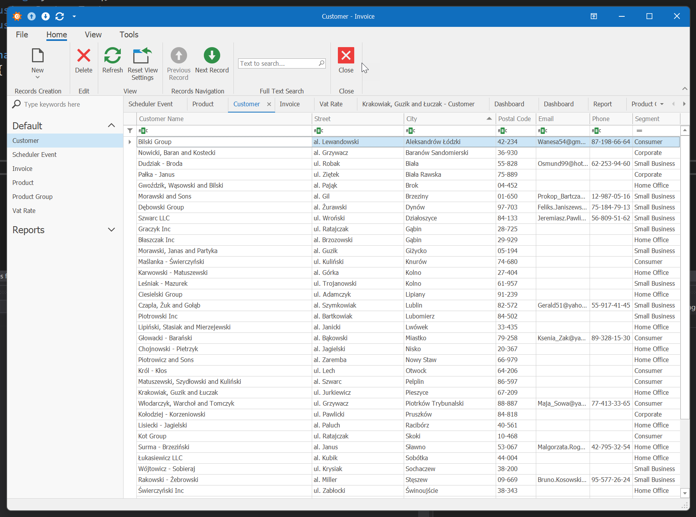
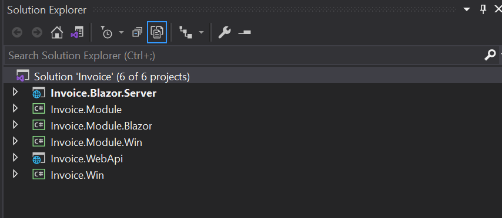

# eXpressApp Framework przyjacielem programisty
## Czyli jak zbudować apliakcję biznesową w 2 godziny


<a href="#wstęp" target="_blank">Wstęp</a>
<a href="#bierzemy-się-za-programowanie" target="_blank">Bierzemy się za programowanie</a>
<a href="#generator-danych-testowych" target="_blank">Generator danych testowych</a>
<a href="#rozbudowujemy-aplikację" target="_blank">Rozbudowujemy aplikację</a>

## Wstęp
Proces tworzenia  oprogramowania składa się z różnych etapów, z których niektóre potrafimy robić dniami i nocami, oraz takie które odkładamy najdłużej jak się da i najchętniej delegujemy junior programmer’owi. W efekcie powstają smutne historie programistów, jak to zajmowali się cały czas np. nudnymi CRUD’ami, układali kontrolki na widokach albo czymś jeszcze gorszym. A o programistę teraz trudno ...

Standardowy proces tworzenia oprogramowania stawia przed programistami nietrywialne wyzwania:
*	 Najprostsze czynności jak przeglądanie czy przechowywanie danych są czasochłonne. Programiści muszą dbać o każdy aspekt tworzonej aplikacji – od zarządzania danymi na poziomie serwerów danych, po dostarczenie edytorów do każdego edytowanego pola.
*	Im bardziej złożony system, tym więcej kodu, tym więcej nieuchronnych błędów. Do celów testowych potrzeba znaczną ilość czasu i zasobów ludzkich.
*	Utrzymanie tak stworzonego systemu nie jest trywialne. Nawet trzymając się wszelkich zasad programowania, wiele zadań będzie wymagało modyfikacji aplikacji w wielu miejscach. Jej rozbudowa jest kosztowna i koszt ten rośnie wraz ze złożonością systemu.

Oczywiście niniejsze podejście ma tez swoje zalety:
*	Każdy aspekt powstającego sytemu jest w pełni kontrolowany przez programistów. Nie są uzależnieni od ograniczeń czy nawet błędów zewnętrznych bibliotek. Wszystko co stworzyli mogą modyfikować i poprawiać w prostszy sposób.
*	Programiści mogą optymalizować system wg własnych potrzeb, co jest trudne do osiągnięcia bazując na zewnętrznych rozwiązaniach.
*	Aplikacje nie muszą być tworzone wg zasad wymaganych przez zewnętrzne narzędzia/biblioteki.

Niekiedy powyższe rozwiązanie jest jedynym wyjściem aby stworzyć właściwy system, często jednak wykonujemy systemy w których pewne funkcjonalności powtarzają się i faktycznie robienie tego samego w kółko zaczyna być nużące. Jest wiele rzeczy, które muszą zostać stworzone za każdym razem, kiedy tworzysz aplikacje biznesową, niektóre jej elementy są do siebie podobne, a jednocześnie na tyle rożne, że nie da się z tego zrobić raz i używać wielokrotnie w pozostałych przypadkach. Trzeba skonfigurować mapowania klas do bazy danych, zaprojektować formatki widoków, kontrolować dostęp współdzielony itp.

Od lat powstają narzędzia, które próbują wyeliminować powtarzalne elementy systemu, które prawie zawsze robi się w podobny sposób niezależnie od tego czy jest to aplikacja do wystawiania faktur, czy program do diagnozowania i leczenia raka. Narzędzia tego typu zwane kiedyś RAD (Rapid Application Development) np. Power Builder, Clarion, Power Apps i wiele innych, w różnym stopniu pozwalają programistom na elastyczność podczas procesu tworzenia aplikacji. Jedne wymagały trzymania się konkretnych zasad i pozwalały na tworzenie aplikacji o dość ograniczonej funkcjonalności, inne pozwalały na większa elastyczność, nie mniej jednak bardzo często kończyło się na egzotycznych trikach by osiągnąć zamierzony cel. O skuteczności tych narzędzi świadczą systemy jakie powstały choćby w Polsce m.in. cała seria WaPro WF-MAG (KaPer,Gang,Fakir) czy Comarch ERP XL stworzone z wykorzystaniem Clarion’a, czy produkty rodziny Simple.ERP, tworzone za pomocą Power Builder’a i wiele innych. Power Apps nawet rozpychają się coraz bardziej w Azure. Nadal jednak pozostaje problem elastyczności tych narzędzi, automatyzacja wielu procesów wymaga ich ustandaryzowania, uproszczenia. 
Gdzieś po środku pojawiają sie frameworki, które wyręczają w implementacji niektórych funkcjonalności np biblioteki ORM zwalniających nas z oprogramowywania warstwy komunikacji z bazami danych, czy automatycznego generowania warstwy prezentacji na podstawie modelu.

Jednym z takich jest <a href="https://docs.devexpress.com/eXpressAppFramework/112670/expressapp-framework" target="_blank">DevExpress eXpressApp Framework (XAF)</a>.  <small>*Jest to narzędzie płatne, ale dostępna jest 30 dniowa wersja testowa, a efekt końcowy jest wart ceny licencji, narzędzie zdecydowanie przyspiesza proces tworzenia aplikacji, a jednocześnie firma oferuje bardzo dobry support techniczny, aktualizacje pojawiają się kilkanaście razy w roku*</small>

ExpressApp Framework znacznie ułatwia proces programowania, przejmując na siebie wykonanie czynności związanych z przechowywaniem danych, ich przeglądaniem, mechanizmami do analizy danych, drukowania. XAF oferuje interfejs wysokiego poziomu ukrywający niektóre szczegóły implementacji i pozwalający skoncentrować się na dziedzinie problemu i logice biznesowej. Niektóre cechy XAF, dzięki którym ten proces jest łatwiejszy:

* Do programowania wykorzystujemy C# lub VisualBasic, mając do dyspozycji wszystko co te języki oferują.

* Logika biznesowa bez większych zmian może być używana na wielu platformach (WinForms, WebForms czy Blazor)

* Automatyczny kreator interfejsu użytkownika, programista nie musi tworzyć wielu podobnych formularzy do przeglądania i edycji danych. Przy okazji ułatwia to utrzymanie aplikacji, ponieważ po zmianie struktury klas, nie ma potrzeby modyfikowania wielu formularzy. XAF zrobi to za nas automatycznie. Np. dodajemy nowe pole w kontrahencie i pojawia się ono na każdej formatce związanej z kontrahentem, dostępne jest w wydruku, statystyce itp.

* Wbudowane zarządzanie danymi. Programista nie musi zajmować się bazą danych, konfigurować ADO.NET. Zwolniony jest też z zajmowania się szczegółami konkretnych systemów baz danych. Wybieramy bazę docelową z dość obszernej listy m.in. (MS SQL, MySQL, Postgres, Oracle, DB2 i inne). Zmiana docelowej bazy sprowadza się do zmiany danych połączenia w konfiguracji.

* Aplikacje są łatwe w rozbudowie. Możemy dopasować czy nawet w pełni wymienić prawie każdy z dostarczonych elementów interfejsu aplikacji czy jej zachowania. Można łączyć XAF z bibliotekami stworzonymi bez jego udziału np pokazać niestandardowe formularze lub kontrolki w oknie stworzonym przez XAF. W wyjątkowych sytuacjach możemy wprowadzić zmiany bezpośrednio w kodzie XAF ponieważ mamy dostęp do kompletnego kodu źródłowego.

* Tworzona aplikacja automatycznie zarządza zmianami struktury w bazie klienta. Jeśli dodamy nowe pola, tabele czy powiązania pomiędzy nimi, aplikacja po uruchomieniu u klienta może samodzielnie dokonać modyfikacji bazy danych. Niewielkie modyfikacje w procedurze aktualizacyjnej wymagane są w sytuacjach zmiany typów danych na istniejących polach czy zmiany relacji pomiędzy tabelami.

* DevExpress dostarcza język skryptowy, który jest bardziej czytelny dla osób nieprogramujących, który używany jest w wyrażeniach filtrujących, polach wyliczanych na formatkach i wydrukach.

* XAF dostarczany jest z wbudowanymi modułami np. do Statystyk, Raportów czy kontroli dostępu. Wiele elementów aplikacji mamy gotowe na starcie.

* Wsparcie techniczne od ludzi z DevExpress jest warte ponownego zasygnalizowania! Nie zdarzyło mi się, żebym nie otrzymał odpowiedzi w później niż po 48 godzinach od zgłoszenia.

Należy jednak pamiętać, że nie będziemy mieli z XAF większego pożytku przy tworzeniu aplikacji innego rodzaju np takich jak gry, programy do obróbki grafiki, kolejnego portalu społecznościowego itp.


XAF opiera się na architekturze MVC. Dane przechowujemy w bazie danych np. MS SQL (Lista wspieranych serwerów baz danych: <a href="https://docs.devexpress.com/XPO/2114/product-information/database-systems-supported-by-xpo" target="_blank">https://docs.devexpress.com/XPO/2114/product-information/database-systems-supported-by-xpo</a> ). Komunikacja z baza danych jest poprzez klasy ORM (XPO lub Entity Framework Core). ORM służy do mapowania struktur tabel bazy danych na klasy w modelu aplikacji. Zadeklarowane klasy modelujące naszą dziedzinę biznesową automatycznie są konwertowane na Widoki (ListView, DetailView) , które pozwalają na dodawanie, modyfikację czy przeglądanie danych. Wygenerowane widoki możemy dostosować do własnych potrzeb, jeśli to co proponuje XAF nie spełnia do końca naszych potrzeb.

**ListView** wyświetlają  kolekcje danych, pozwalają je sortować i przeszukiwać z wykorzystaniem zaawansowanych metod filtrowania.




**DetailView** pozwalają na prace z pojedynczym obiektem (rekordem danych) wyświetlając dane w odpowiednich edytorach. Wykorzystywane są do dodawania i edycji danych.


**DashboardView** pozwala grupować wiele innych widoków na jednym oknie.

#### Klasy biznesowe

Model biznesowy definiujemy za pomocą klas określanych jako Business Object (BO), dla których zostaną utworzone struktury tabel i relacji w bazie danych i jednocześnie zostaną utworzone widoki używane w interfejsie aplikacji. DevExpress dostarcza Business Class Library (<a href="https://docs.devexpress.com/eXpressAppFramework/112571/business-model-design-orm/built-in-business-classes-and-interfaces" target="_blank">https://docs.devexpress.com/eXpressAppFramework/112571/business-model-design-orm/built-in-business-classes-and-interfaces</a>) w której zdefiniowane są najczęściej używane BO (Address, Person, Note, Organization) oraz klasy potrzebne we wbudowanych modułach dodatkowych (m.in. Reports, Dashboards, Security). Nie jesteśmy ograniczeni do tych klas, możemy definiować własne, co zrobimy w dalszej części tego artykułu. DevExpress dostarcza nam kompletny kod źródłowy i lektura kodu powyższych klas jest najlepsza metoda nauki, jak definiować własne klasy. 

#### Moduły rozszerzające

XAF zawiera kilkanaście modułów rozszerzających funkcjonalność aplikacji. Np wystarczy dołożyć do projektu moduł **Reports** aby w aplikacji pojawił się rozbudowany edytor wydruków. Dodając moduł Security otrzymujemy zaawansowaną obsługę kontroli dostępu do aplikacji. Wykaz standardowych modułów dostępny w XAF:
<a href="https://docs.devexpress.com/eXpressAppFramework/118046/application-shell-and-base-infrasctructure/application-solution-components/modules#modules-shipped-with-xaf" target="_blank">https://docs.devexpress.com/eXpressAppFramework/118046/application-shell-and-base-infrasctructure/application-solution-components/modules#modules-shipped-with-xaf</a>


#### Kontrolery i akcje

XAF automatycznie generuje UI na podstawie modelu biznesowego (BO), który zawiera wbudowane funkcjonalności pozwalające na komfortową prace z danymi jak filtrowanie, wyszukiwanie, tworzenie i wywoływanie wydruków, eksportowanie danych do wielu formatów itp. O ile w prostych aplikacjach to może być wystarczające, to w rozbudowanych aplikacjach istnieją bardziej złożone wymagania. W celu oprogramowania dodatkowych funkcjonalności, XAF używa koncepcji kontrolerów i akcji. 
Kontrolery używamy głównie w dwóch sytuacjach:

* Wykonania określonych akcji gdy Okno(Widok) jest tworzone lub zamykane.

    Przy otwarciu Okna, wszystkie kontrolery które są dla niego przeznaczone zostają aktywowane, co oznacza, że wywoływane są konkretne zdarzenia np Controller.Activated. Zdarzenia te można użyć w celu zaimplementowania funkcji związanych z bieżącym oknem lub jego widokiem.
    Podczas zamykania wywoływane są kolejne zdarzenia np. Controller.Deactivated, gdzie także można oprogramowac dodatkowe funkcjonalności. *W uproszczeniu można je porównać do zdarzeń jakie mamy dostępne podczas używania formatki Form z WinForms np Activated, Load, Activated itp.*

* Rozszerzenie interfejsu użytkownika
  
    W większości przypadków działanie aplikacji polega na interakcji z użytkownikiem. W tym celu Kontrolery mogą służyć jako kontenery dla akcji. Akcje to obiekty, które reprezentują abstrakcyjne elementy użytkownika i mogą być wyświetlane w systemie użytkownika przy użyciu rzeczywistych kontrolek: Button, ComboBox, SubMenu. W celu obsłużenia działania uzytkownika na kontrolce bedącej Akcją, należy obsłużyć odpowiednie zdarzenia. *Odpowiednik OnTextChanged OnClick itp. w WinForms*


W XAF rozróżniamy 4 rodzaje akcji:
* SimpleAction - służy do wykonywania zaprogramowanych funkcjonalności, gdy użytkownik kliknie na prostym przycisku.
* PopupWindowAction - wywołuje okno popup z zadeklarowanym widokiem, gdzie użytkownik może wpisać dane a następnie po naciśnięciu OK lub Cancel, wykonuje dalsze działanie.
* ParametrizedAction - wykonuje kod po wprowadzeniu przez użytkownika wartości do kontrolki skojarzonej z akcją.
* SingleChoiceAction - wykonuje kod po wybraniu jednej z opcji określonej podczas tworzenia akcji


#### Application Model

Application Model przechowuje wszystkie informacje potrzebne do zbudowania UI aplikacji. Np zawiera informacje jakie edytory przypisaliśmy dla poszczególnych typów danych, jak ułożone są kontrolki na ekranie i jakie etykiety przypisaliśmy poszczególnym polom. 
Application Model automatycznie wypełniany jest danymi na podstawie zadeklarowanych klas BO oraz kontrolerów. MOdel można zmieniać za pomocą dedykowanego edytora zintegrowanego w Visual Studio lub zwykłym edytorem tekstowym ponieważ jest on zapisywany jako plik XML.


# Bierzemy się za programowanie

Wyobraźmy sobie "standardową" specyfikację wymagań: 

***Zróbcie program do fakturowania tak aby było dobrze! Da radę na jutro ?***

W zależności od poziomu asertywności należy przydałoby się zlecającego wysłać do dev/null, albo jeszcze dalej. W końcu analiza tego zagadnienia w szczegółach to materiał na kolejny artykuł. Zróbmy jednak prostą analizę zagadnienia:

Fakturę wystawia się firmie lub osobie fizycznej - tu można zrobić uproszczenie i  dane osoby wpisywać do danych firmy. Na fakturze umieszcza się sprzedawane produkty - czyli potrzebujemy rejestr produktów.
Produkty przydałoby się dzielić na grupy, a klientów klasyfikować wg ich wielkości. Takie instytucje jak GUS udostępniają API pozwalającego pobrać dane każdego podmiotu prowadzącego działalność gospodarczą. Dobrze, żeby nasz program pozwala na weryfikacje takich danych -przyspieszy to proces wpisywania kontrahenta i jednocześnie wzrośnie poziom <a href="https://pl.wikipedia.org/wiki/Mana_(fantasy)" target="_blank">Many</a> w firmie.

Po dalszej analizie zależności pomiędzy tabelami powinny wyglądać mniej więcej tak:

<div class="mermaid">
    erDiagram
      CUSTOMER ||--o{ INVOICE : get
      INVOICE ||--|{ INVOICEITEM : contains
      PRODUCT ||--|{ INVOICEITEM : in
      VATRATE ||--|{ INVOICEITEM : use
      VATRATE ||--|{ PRODUCT : use
      PRODUCT }|--|{ PRODUCTGROUP : has
</div>


W skrócie: należy zdefiniować klasy, które odzwierciedlą tabele bazy danych używane przez aplikację. Uzupełnić je o powiązania pomiędzy nimi w celu zamodelowania relacji. 
Opcjonalnie dodać kilka kontrolerów i akcji np do weryfikacji klienta w US/GUS. Zmodyfikować w modelu domyślne widoki wg naszych upodobań - w końcu nie każdemu będzie się podobało to co domyślnie zaproponuje XAF.

1. Tworzymy nowy projekt w VS.
2. Z dostępnych szablonów wybieramy DevExpress v21.2 XAF Template Gallery (c#) 


3. Po wpisaniu nazwy projektu i zatwierdzeniu pojawi się okno XAF Solution Wizard Klikamy *Run wizard*.
   


    Ważne jest aby upewnić się, że wybraliśmy framework .Net Core oraz język programowania C#. Gdybyśmy wybrali NetFramework zamiast NetCore

4. Wybieramy docelowe platformy - proponuję wybrać obie jednocześnie, dzięki temu uzyskamy aplikacje WinForms oraz Web Blazor.


5. Na oknie z wyborem ORM wybieramy XPO. Jest to <a href="https://docs.devexpress.com/XPO/1998/express-persistent-objects" target="_blank">ORM dostarczany przez DevExpress</a> i zwykle pewne funkcjonalności w XAF pojawiają się wcześniej dla XPO niż Entity Framework. Jednocześnie DevExpress utrzymuje że <a href="https://github.com/DevExpress/XPO/tree/master/Benchmarks" target="_blank">wydajnościowo XPO jest dużo lepsze od Entity Framework</a>. 


6. Na oknie Choose Security wybieramy *Standard* i wybieramy obie metody uwierzytelniania


7. Na oknie z dodatkowymi modułami wybieramy Bussines Class Library, Conditional Appearance, Dashboard, Reports, Scheduler i Validation. 


8. Klikamy *Finish* i po kilku sekundach zostaną wygenerowane odpowiednie projekty.



Kilka słów o powyższej strukturze projektów:

* Invoice.Module

    Wspólny projekt wykorzystywany przez pozostałe, to tutaj koncentruje się większość kodu o ile nie jest on specyficzny dla konkretnej platformy (platform agnostic). 
    Praktycznie wszystkie klasy z naszym modelem biznesowym powinny znajdować się w tym projekcie. Tutaj implementować będziemy także kontrolery niezależne od platformy.

* Invoice.Module.Win

    Tutaj definiujemy Edytory i Kontrolery dedykowane dla platformy WinForms. Uwaga klasy BO zdefiniowane tutaj nie będą widziane w aplikacji Blazor!
    
* Invoice.Module.Blazor    

    Tutaj definiujemy Edytory i Kontrolery dedykowane dla platformy Blazor. Uwaga klasy BO zdefiniowane tutaj nie będą widziane w aplikacji Win! 

* Invoice.Win
  
    Praktycznie jest to projekt z którego powstaje plik wykonywalny aplikacji. Ewentualne zmiany w tym projekcie obejmować mogą pliki Program.cs oraz WinApplication.cs i konfiguracji. Tutaj nie należy definiować kontrolerów ani klas BO. Nie będą one widoczne dla mechanizmów XAF i nie zostaną uwzględnione w modelu aplikacji.
    
    W pliku App.config możemy zmodyfikować połączenie do bazy danych:
    
    `<add name="ConnectionString" connectionString="Integrated Security=SSPI;Pooling=false;Data Source=(localdb)\mssqllocaldb;Initial Catalog=Invoice" />`
    
* Invoice.Blazor.Server
  
    Praktycznie jest to projekt z którego powstaje plik wykonywalny serwisu który umieścimy w kontenerze lub w IIS. Podobnie jak dla wersji WIN, ewentualne zmiany w tym projekcie obejmować mogą pliki Program.cs oraz WinApplication.cs oraz plików konfiguracji. Tutaj nie należy definiować kontrolerów ani klas BO. 
    
    W pliku appsettings.json możemy zmodyfikować połączenie do bazy danych
    
    `"ConnectionString": "Integrated Security=SSPI;Pooling=false;Data Source=(localdb)\\mssqllocaldb;Initial Catalog=Invoice",`
* Invoice.WebApi

    Funkcjonalność wprowadzona w najnowszej wersji DevExpress. Serwis WebApi, który możemy użyć do modyfikacji danych z zewnętrznych aplikacji np aplikacji zrobionej w NET. MAUI. Wystarczy określić jakie BO chcemy udostępniać na zewnątrz i API do naszego sytemu gotowe.
    *Generowanie tego projektu nie jest potrzebne jeśli tworzymy projekt dla platformy Blazor. Invoice.Blazor.Server także może działać jako WebApi*

    
### Business Objects

Klasy możemy stworzyć na 3 sposoby:
1.	Model First - Definiując klasy i powiązania w dedykowanym Edytorze Modelu (XPO Data Model Designer) i generując klasy na podstawie tego modelu.
2.	Database First – importując struktury z istniejącej bazy danych do Edytora Modelu i następnie wygenerowanie klas.
3.	Code First – Deklarując klasy bezpośrednio w kodzie.

Osobiście preferuję wariant 3-ci – czyli klasy definiowane bezpośrednio w kodzie. <a href="https://docs.devexpress.com/CodeRushForRoslyn/115802/coderush" target="_blank">W tym procesie pomocny będzie CodeRush</a>, jest to rozszerzenie do VS wspomagające programistę w podstawowym procesie programowania, refaktoryzacji, debugowania czy testowania (odpowiednik ReSharpera od JetBrains). Używając <a href="https://community.devexpress.com/blogs/markmiller/archive/2018/04/25/coderush-cheat-sheet-v3.aspx" target="_blank">odpowiednich skrótów klawiszowych</a>, czyni proces kodowania zdecydowanie szybszy od robienia tego w Model Designerze.

Potrzebujemy następujące klasy i ich pola:


##### Klient
```csharp
 [DefaultClassOptions]
    public class Customer : BaseObject
    {
        public Customer(Session session) : base(session)
        { }


        Segment segment;
        string notes;
        string postalCode;
        string city;
        string street;
        string customerName;
        string vatNumber;
        string symbol;

        [Size(SizeAttribute.DefaultStringMappingFieldSize)]
        public string Symbol
        {
            get => symbol;
            set => SetPropertyValue(nameof(Symbol), ref symbol, value);
        }

        [Size(SizeAttribute.DefaultStringMappingFieldSize)]
        public string VatNumber
        {
            get => vatNumber;
            set => SetPropertyValue(nameof(VatNumber), ref vatNumber, value);
        }


        [Size(SizeAttribute.DefaultStringMappingFieldSize)]
        public string CustomerName
        {
            get => customerName;
            set => SetPropertyValue(nameof(CustomerName), ref customerName, value);
        }


        [Size(SizeAttribute.DefaultStringMappingFieldSize)]
        public string Street
        {
            get => street;
            set => SetPropertyValue(nameof(Street), ref street, value);
        }


        [Size(SizeAttribute.DefaultStringMappingFieldSize)]
        public string City
        {
            get => city;
            set => SetPropertyValue(nameof(City), ref city, value);
        }

        [Size(SizeAttribute.DefaultStringMappingFieldSize)]
        public string PostalCode
        {
            get => postalCode;
            set => SetPropertyValue(nameof(PostalCode), ref postalCode, value);
        }


        
        public Segment Segment
        {
            get => segment;
            set => SetPropertyValue(nameof(Segment), ref segment, value);
        }

        [Association]
        public XPCollection<Invoice> Invoices
        {
            get
            {
                return GetCollection<Invoice>(nameof(Invoices));
            }
        }

        
        [Size(SizeAttribute.Unlimited)]
        public string Notes
        {
            get => notes;
            set => SetPropertyValue(nameof(Notes), ref notes, value);
        }

    }

    public enum Segment
    { 
        
        Corporate= 2,
        Consumer = 7,
        [XafDisplayName("Home Office")]
        HomeOffice = 0,
        [XafDisplayName("Small Business")]
        SmallBusiness =9
    }
```

W przypadku typów wyliczeniowych możemy wymusić aby XAF wyświetlał inne opisy niż wynika z nazw poszczególnych wartości typu stosując atrybut *XafDisplayName*.

##### Produkt

```csharp
[DefaultClassOptions]
public class Product : BaseObject
{
    public Product(Session session) : base(session)
    { }


    string notes;
    string gTIN;
    string productName;
    string symbol;

    [Size(SizeAttribute.DefaultStringMappingFieldSize)]
    public string Symbol
    {
        get => symbol;
        set => SetPropertyValue(nameof(Symbol), ref symbol, value);
    }


    [Size(SizeAttribute.DefaultStringMappingFieldSize)]
    public string ProductName
    {
        get => productName;
        set => SetPropertyValue(nameof(ProductName), ref productName, value);
    }


    [Size(SizeAttribute.DefaultStringMappingFieldSize)]
    public string GTIN
    {
        get => gTIN;
        set => SetPropertyValue(nameof(GTIN), ref gTIN, value);
    }

    
    [Size(SizeAttribute.Unlimited)]
    public string Notes
    {
        get => notes;
        set => SetPropertyValue(nameof(Notes), ref notes, value);
    }

}
```

##### Faktura

```csharp
[DefaultClassOptions]
   public class Invoice : BaseObject
   {
       public Invoice(Session session) : base(session)
       { }


       string notes;
       decimal brutto;
       decimal vat;
       decimal netto;
       Customer customer;
       DateTime dueDate;
       DateTime invoiceDate;
       string invoiceNumber;

       [Size(SizeAttribute.DefaultStringMappingFieldSize)]
       public string InvoiceNumber
       {
           get => invoiceNumber;
           set => SetPropertyValue(nameof(InvoiceNumber), ref invoiceNumber, value);
       }


       public DateTime InvoiceDate
       {
           get => invoiceDate;
           set => SetPropertyValue(nameof(InvoiceDate), ref invoiceDate, value);
       }


       public DateTime DueDate
       {
           get => dueDate;
           set => SetPropertyValue(nameof(DueDate), ref dueDate, value);
       }


       public Customer Customer
       {
           get => customer;
           set => SetPropertyValue(nameof(Customer), ref customer, value);
       }


       public decimal Netto
       {
           get => netto;
           set => SetPropertyValue(nameof(Netto), ref netto, value);
       }


       public decimal Vat
       {
           get => vat;
           set => SetPropertyValue(nameof(Vat), ref vat, value);
       }


       public decimal Brutto
       {
           get => brutto;
           set => SetPropertyValue(nameof(Brutto), ref brutto, value);
       }

       
       [Size(SizeAttribute.Unlimited)]
       public string Notes
       {
           get => notes;
           set => SetPropertyValue(nameof(Notes), ref notes, value);
       }
   }
   
   
     public class InvoiceItem : BaseObject
    {
        public InvoiceItem(Session session) : base(session)
        { }


        Invoice invoice;
        decimal brutto;
        decimal vat;
        decimal netto;
        decimal unitPrice;
        decimal quantity;
        Product product;

        public Product Product
        {
            get => product;
            set => SetPropertyValue(nameof(Product), ref product, value);
        }


        [Association]
        public Invoice Invoice
        {
            get => invoice;
            set => SetPropertyValue(nameof(Invoice), ref invoice, value);
        }

        public decimal Quantity
        {
            get => quantity;
            set => SetPropertyValue(nameof(Quantity), ref quantity, value);
        }


        public decimal UnitPrice
        {
            get => unitPrice;
            set => SetPropertyValue(nameof(UnitPrice), ref unitPrice, value);
        }


        public decimal Netto
        {
            get => netto;
            set => SetPropertyValue(nameof(Netto), ref netto, value);
        }

        public decimal Vat
        {
            get => vat;
            set => SetPropertyValue(nameof(Vat), ref vat, value);
        }

        
        public decimal Brutto
        {
            get => brutto;
            set => SetPropertyValue(nameof(Brutto), ref brutto, value);
        }

    }
```


#### Relacje

W naszym przypadku mamy do czynienia z następującymi relacjami:

* <a href="#faktury-klienta" target="_blank">Klient może mieć dowolną liczbę faktur 1-M</a>
* <a href="#pozycje-faktury" target="_blank">Faktura ma co najmniej jedna pozycję 1-M</a>
* Każda pozycja jest w relacji do Produktu. (Produkt może być na wielu pozycjach) 1-N.
* <a href="#grupy-produktów" target="_blank">Produkt może należeć do wielu grup M-M</a>

W fakturze do pola Customer dodajemy adnotację *Association* (aby wskazać ze po tej kolumnie jest powiązanie do kolekcji faktur w kliencie) oraz dodajemy kolekcję Pozycji faktury i oznaczamy je odpowiednimi adnotacjami *Association* i *Aggregated*.


### Faktury klienta
```csharp
[Association]
public Customer Customer
{
    get => customer;
    set => SetPropertyValue(nameof(Customer), ref customer, value);
}

...

W klasie klienta dodajemy kolekcję do wyświetlania listy faktur

```csharp


[Association,Aggregated]
public XPCollection<Invoice> Invoices
{
    get
    {
        return GetCollection<Invoice>(nameof(Invoices));
    }
}
```

### Pozycje faktury


A w pozycji dodajemy powiązanie do faktury:

```csharp
[Association]
public Invoice Invoice
{
    get => invoice;
    set => SetPropertyValue(nameof(Invoice), ref invoice, value);
}
```
W fakturze kolekcję pozycji:

```csharp
  [Association, DevExpress.Xpo.Aggregated]
public XPCollection<InvoiceItem> Items
{
    get
    {
        return GetCollection<InvoiceItem>(nameof(Items));
    }
}
```

### Grupy produktów

W przypadku powiązania produktów z grupami należy w obu klasach dodać kolekcje z obiektami drugiej klasy i oznaczyć je atrybutem *Association* z tą samą nazwą

```csharp
public class Product : BaseObject
{      
        ...
        [Association("Product-Products")]
        public XPCollection<ProductGroup> Groups
        {
            get
            {
                return GetCollection<ProductGroup>(nameof(Groups));
            }
        }
        ...
}    

```
Dodajemy brakująca klasę z grupa produktu:

```csharp
[DefaultClassOptions]
public class ProductGroup : XPObject
{
    public ProductGroup(Session session) : base(session)
    { }


    string groupName;

    [Size(SizeAttribute.DefaultStringMappingFieldSize)]
    public string GroupName
    {
        get => groupName;
        set => SetPropertyValue(nameof(GroupName), ref groupName, value);
    }

    [Association("Product-Products")]
    public XPCollection<Product> Products
    {
        get
        {
            return GetCollection<Product>(nameof(Products));
        }
    }

}
```


Kompilujemy i uruchamiamy program. Do dyspozycji mamy wersje WinForms lub Blazor. W zależności od tego co wybierzemy naszym oczom pojawi się wersja Windowsowa:


Jak widać dostajemy z automatu możliwość prostego wyszukiwania w liście w sposób znany choćby z programu Excel. Jak i bardzie zaawansowany edytor filtrów:


lub Webowa:


Na powyższym zdjęciu widać ze musimy dopieścić formatowanie liczb i wyliczanie wartości pozycji i kompletnej faktury.
Dlatego w pozycji faktury dodamy metodę, która pozwoli nam na wyliczenie wartości faktury, następnie na poziomie faktury dodamy kod, który będzie sumował pozycje. Tu pojawia się dylemat architektoniczny, który zawsze trzeba przeanalizować - czy chcemy dane wyliczać za każdym razem gdy potrzebna nam jest ta informacja, czy zapamiętywać w bazie danych. Zapamiętywanie danych w bazie danych ma więcej zalet niż wad - najistotniejsze jest to, że przy większej ilości danych jest szybciej. Dlatego tutaj też zastosujemy to rozwiązanie.

W pierwszej kolejności metoda wyliczająca netto, VAT i brutto po wpisaniu ilości.
Żeby liczyć VAT, musimy uzupełnić aplikację o stawki VAT, wiec dodajemy nowa klasę: VatRate:

```csharp
[DefaultClassOptions]
public class VatRate : XPLiteObject
{
    public VatRate(Session session) : base(session)
    { }


    decimal rateValue;
    string symbol;

    [Size(3)]
    public string Symbol
    {
        get => symbol;
        set => SetPropertyValue(nameof(Symbol), ref symbol, value);
    }

    
    public decimal Value
    {
        get => rateValue;
        set => SetPropertyValue(nameof(Value), ref rateValue, value);
    }
}
```

Do klasy produktu dodajemy domyślne: Cenę jednostkową i stawkę Vat:

```csharp
VatRate vatRate;
decimal unitPrice;

public decimal UnitPrice
{
    get => unitPrice;
    set => SetPropertyValue(nameof(UnitPrice), ref unitPrice, value);
}


public VatRate VatRate
{
    get => vatRate;
    set => SetPropertyValue(nameof(VatRate), ref vatRate, value);
}
```

W pozycji faktury Stawkę Vat:

```csharp
VatRate vatRate;
public VatRate VatRate
{
    get => vatRate;
    set => SetPropertyValue(nameof(VatRate), ref vatRate, value);
}
```

W przypadku pozycji faktury chcemy przeliczyć jej wartość jeśli zmieni się cena jednostkowa i/lub ilość. Tutaj wystarczy wywołać metodę przeliczająca jeśli zmieniła się wartość na polach: cena jednostkowa i ilość. Dodatkowo w przypadku zmiany produktu, należy podstawić nową stawkę VAT i cenę jednostkową:

```csharp
...
[ImmediatePostData]
public Product Product
{
    get => product;
    set
    {
        bool modified = SetPropertyValue(nameof(Product), ref product, value);
        if (modified && !IsLoading && !IsSaving && Product != null)
        {
            unitPrice = Product.UnitPrice;
            vatRate = Product.VatRate;
            RecalculateItem();

        }
    }
}
...

[ImmediatePostData]
public decimal Quantity
{
    get => quantity;
    set
    {
        bool modified = SetPropertyValue(nameof(Quantity), ref quantity, value);
        if (modified && !IsLoading && !IsSaving)
        {
            RecalculateItem();

        }
    }
}
        
...       

[ImmediatePostData]
public VatRate VatRate
{
    get => vatRate;
    set
    {
        bool modified = SetPropertyValue(nameof(VatRate), ref vatRate, value);
        if (modified && !IsLoading && !IsSaving)
        {
            RecalculateItem();
        }
    }
}

```


Wyliczanie po zmianie wartości Netto na Brutto i na odwrót nie ma w tym przypadku sensu, ale warto zablokować użytkownikowi możliwość edycji tych pól. Najprościej jest to zrobić dodając do nich odpowiedni atrybut *ModelDefault*:

```csharp

...

[ModelDefault("AllowEdit", "False")]
public decimal Netto
{
    get => netto;
    set => SetPropertyValue(nameof(Netto), ref netto, value);
}

[ModelDefault("AllowEdit", "False")]
public decimal Vat
{
    get => vat;
    set => SetPropertyValue(nameof(Vat), ref vat, value);
}

[ModelDefault("AllowEdit", "False")]
public decimal Brutto
{
    get => brutto;
    set => SetPropertyValue(nameof(Brutto), ref brutto, value);
}

...
```

Podobnie robimy w fakturze z odpowiednimi polami. Dodajemy metodę która zsumuje nam pozycje faktury RecalculateTotals. Metoda ta będzie wywoływana z poziomu pozycji wtedy, gdy ją przeliczymy lub wtedy gdy zmianie ulegnie faktura powiązana z pozycją - np. gdy pozycja zostanie podpięta do innej faktury lub zostanie usunięta.

```csharp
    public class Invoice : BaseObject
    {
    ...
        internal void RecalculateTotals(bool forceChangeEvents)
              {
                  decimal oldNetto = Netto;
                  decimal? oldVAT = Vat;
                  decimal? oldBrutto = Brutto;
        
        
                  decimal tmpNetto = 0m;
                  decimal tmpVAT = 0m;
                  decimal tmpBrutto = 0m;
        
                  foreach (var rec in Items)
                  {
                      tmpNetto += rec.Netto;
                      tmpVAT += rec.Vat;
                      tmpBrutto += rec.Brutto;
                  }
                  Netto = tmpNetto;
                  Vat = tmpVAT;
                  Brutto = tmpBrutto;
        
                  if (forceChangeEvents)
                  {
                      OnChanged(nameof(Netto), oldNetto, Netto);
                      OnChanged(nameof(Vat), oldVAT, Vat);
                      OnChanged(nameof(Brutto), oldBrutto, Brutto);
                  }
              }
              ...
    }
    
    public class InvoiceItem : BaseObject
    {
    ...
    
            public Product Product
        {
            get => product;
            set
            {
                bool modified = SetPropertyValue(nameof(Product), ref product, value);
                if (modified && !IsLoading && !IsSaving && Product != null)
                {
                    unitPrice = Product.UnitPrice;
                    vatRate = Product.VatRate;
                    RecalculateItem();
                }
            }
        }
        
        
        
    ...
        private void RecalculateItem()
        {


           ...

            if (Invoice != null)
            {
                Invoice.RecalculateTotals(true);
            }
        }
        
        ...
    }
```

Wersja WinForms


Wersja Blazor


I nasza aplikacja do fakturowania jest prawie gotowa. Patrząc na powyższy obrazek zostają nam drobne rzeczy do poprawy: w miejscu w miejscu faktury widzimy identyfikator, zamiast bardziej czytelnej dla ludzi nazwy lub numeru faktury. Załatwi to dla nas atrybut *XafDefaultProperty*. W parametrze atrybuty wskazujemy nazwę pola, które chcemy wyświetlać zamiast wartości z identyfikatora. *Standardowo XAF szuka pierwszego pola w którego nazwie występuje słowo `Name` i to pole jest brane jako domyślne.*
```csharp
...
[XafDefaultProperty(nameof(InvoiceNumber))]
public class Invoice : BaseObject
{
    public Invoice(Session session) : base(session)
...
}
```
Kolejny drobiazg do rozwiązania to numer faktury. Powinien być unikalny i nie może być pusty. Można zrobić żeby automatycznie się wyliczał lub wymusić na użytkowniku, aby wpisywał właściwą wartość. Dla uproszczenia zastosujemy drugie rozwiązanie.  XAF dostarcza nam dodatkowy moduł przeznaczony do weryfikacji poprawności wprowadzanych danych: Validation (<a href="https://docs.devexpress.com/eXpressAppFramework/113684/validation-module" target="_blank">https://docs.devexpress.com/eXpressAppFramework/113684/validation-module</a>), który służy do weryfikacji poprawności danych i wystarczy, że dodamy dwie adnotacje:

```csharp
using DevExpress.Persistent.Validation;

public class Invoice : BaseObject
{
...
  
    [RuleRequiredField]
    [RuleUniqueValue]
    public string InvoiceNumber
    {
        get => invoiceNumber;
        set => SetPropertyValue(nameof(InvoiceNumber), ref invoiceNumber, value);
    }
...
}
```
Teraz jeśli użytkownik będzie chciał zapisać takie dane otrzyma komunikat błędu:


### Zmiany w modelu

Przy wszystkich polach typu decimal program domyślnie wyświetla nam lokalną walutę (stosuje maskę Currency {0:C}), chcemy ją zmienić w naszej aplikacji na {0:N}. W tym celu w projekcie Invoice.Module.Win odszukujemy Model.DesignedDiffs.xafml, po kliknięciu na nim otworzy się Model Editor, w którym odszukujemy gałąź: ViewItems/PropertyEditors/System.Decimal i zmieniamy DefaultDisplayFormat na {0:N}.


Podobnie w wersji Blazor


W efekcie mamy aplikację która pozwala na prostą sprzedaż, którą po nabyciu niewielkiej wprawy jesteśmy napisać poniżej kilku godzin, w tym także powstanie wydruk faktury, statystyka (dashboard). I mamy resztę dnia na korpo meetingi w teamsach czy innych zoomach, ewentualnie popykać w piłkarzyki lub nowy FarCry na PS5 lub X1.

### Wydruk faktury


### Dashboard

Opisanie procesu tworzenia dashboardu ...


### Jak to wszystko działa ...

Chociaż XAF pomaga programistom zaoszczędzić znaczną ilość czasu, sama architektura nie kontroluje każdego aspektu procesu tworzenia oprogramowania. Nadal należy stosować się do dobrych praktyk, tworzyć testy jednostkowe i co ważne dla rozbudowanych aplikacji dobrze rozpoznać dziedzinę i zaprojektować architekturę tworzonej aplikacji. Wbrew pozorom to nie jest narzędzie dla początkujących programistów.
Część klas można wyklikać w edytorze lub zaimportować z istniejącej bazy danych i uruchomić działająca aplikację bez napisania linijki kodu, ale do tworzenia złożonych aplikacji nadal niezbędna jest znajomość Visual Studio, programowania obiektowego, tworzenia zapytań LINQ itp. Dobrze jest znać dobre praktyki dla używanych technologii. Kluczowa jest znajomość samych zasad funkcjonowania XAF i XPO.

#### Kontrola wspóldzielonego dostepu do danych (Optimistic Locking)
Obsługa współdzielonego dostępu do bazy danych wymagana jest w każdej poważnej aplikacji biznesowej. XPO obsługuje wariant optymistyczny. Głównym zadaniem OL jest kontrola modyfikacji tego samego obiektu przez wielu użytkowników. Do tego celu używane jest pole OptimisticLockingField automatycznie dodawane do tworzonych tabel (w wybranych typach klas XPO - szczegóły w tabelce niżej). Gdy obiekt odczytywany jest z bazy danych, zapamiętywana jest wartość z OptimisticLockingField. Gdy obiekt jest zmieniany, zapamiętana wartość porównywana jest z wartością w bazie i jeśli się różnią zgłaszany jest wyjątek LockingException. Jeśli wartości są równe, pole OptimisticLockingField jest aktualizowane (domyślnie jest to inkrementowane pole typu int) i obiekt jest zapisywany do bazy.

#### Odroczone usuwanie danych (Deferred Deletion) poszukać odpowiednika po polsku !!!

Jeśli nasz klasy BO dziedziczą po XPObject, XPCustomObject lub BaseObject włączone jest Deferrd Deletion. Oznacza to, że w momencie usuwania danych, XPO nie usuwa fizycznie rekordu z bazy, tylko oznacza go jako usuniętego wypełniając pole GCRecord. Podczas wyświetlania kolekcji danych (np na ListView), pobierane są jedynie rekordy, w których GCRecord ma wartość NULL.Pobierane są jedynie gdy pobieramy dane z którymi były w relacji (usunięty rekord jest widoczny, ale nie można go edytować). To rozwiązanie pozwala uniknąć błędów w czasie usuwania lub późniejszego dostępu do danych które były powiązane z usuniętym obiektem.
Usunięty w ten sposób rekord można odzyskać wstawiając do pola GCRecord wartość NULL.

Tworząc obiekty biznesowe w bieżącej aplikacji, w większości użyłem klas XPO, które można podzielić wg ich funkcjonalności i przeznaczenia:


| Typ Obiektu XPO | Wbudowany OID | Deferred Deletion | Optimistic Locking |                            Uwagi                             |
| :-------------: | :-----------: | :---------------: | :----------------: | :----------------------------------------------------------: |
|XPObject     |      TAK      |        TAK        |        TAK         | Domyślny typ dla aplikacji XAF, najlepszy dla nowo tworzonych aplikacji |
|  XPLiteObject   |      NIE      |        NIE        |        NIE         | Typ używany dla zaimportowanych BO z bazy danych, gdy zależy nam aby nie modyfikować struktury istniejącej bazy danych |
| XPCustomObject  |      NIE      |        TAK        |        TAK         | Typ używany dla zaimportowanych BO z bazy danych, gdzie chcemy użyć wbudowanego mechanizmu DD i OL |
| PersistentBase  |      NIE      |        NIE        |        TAK         | Praktycznie nie używany w XAF, służy jako bazowy do pozostałych |
|  XPBaseObject   |      NIE      |        NIE        |        TAK         |                             j.w.                             |
|   BaseObject    |      TAK      |        TAK        |        TAK         | W sytuacji gdy potrzebujemy użyć GUID w polu identyfikatora, można użyć tego typu zamiast XPObject |

#### Object Space

Wszystkie operacje związane z bazą danych odbywają się poprzez ObjectSpace. Object Space pozwala nam na edycję czy przeszukiwanie danych jako transakcji. Każdy tworzony widok posiada swój ObjectSpace, który zajmuje się dostarczeniem danych do widoku, rejestruje zmiany obiektów widoku i pozwala je zapisać w bazie danych. Dostęp do ObjectSpace mamy poprzez `View.ObjectSpace`. Możemy z niego korzystać np w kontrolerach. Nie mniej jednak View.ObjectSpace jest przewidziany do operacji związanych z obsługiwanym widokiem. Jeśli chcemy przeprowadzać złożone operacje na wielu danych lepiej jest utworzyć osobny ObjectSpace za pomocą komendy `Application.CreateObjectSpace`.

Więcej na stronach DevExpress:
<a href="https://docs.devexpress.com/eXpressAppFramework/113710/data-manipulation-and-business-logic/ways-to-implement-business-logic?p=net5" target="_blank">https://docs.devexpress.com/eXpressAppFramework/113710/data-manipulation-and-business-logic/ways-to-implement-business-logic?p=net5</a>

<a href="https://docs.devexpress.com/eXpressAppFramework/113711/data-manipulation-and-business-logic/create-read-update-and-delete-data?p=net5" target="_blank">https://docs.devexpress.com/eXpressAppFramework/113711/data-manipulation-and-business-logic/create-read-update-and-delete-data?p=net5</a>


## Rozbudowujemy aplikację

W przypadku niektórych danych chcielibyśmy mieć informację o tym, kto i kiedy utworzył rekord lub go modyfikował. Napiszemy w tym celu klasę **CustomBaseObject**, która będzie wypełniać te dane. 

```csharp
[NonPersistent]
   public abstract class CustomBaseObject : BaseObject
   {
       public CustomBaseObject(Session session)
           : base(session)
       {
       }
       PermissionPolicyUser GetCurrentUser()
       {
           return Session.GetObjectByKey<PermissionPolicyUser>(SecuritySystem.CurrentUserId);

       }
       public override void AfterConstruction()
       {
           base.AfterConstruction();
           CreatedOn = DateTime.Now;
           CreatedBy = GetCurrentUser();
       }
       protected override void OnSaving()
       {
           base.OnSaving();
           UpdatedOn = DateTime.Now;
           UpdatedBy = GetCurrentUser();
       }
       PermissionPolicyUser createdBy;
       [ModelDefault("AllowEdit", "False")]
       [DetailViewLayoutAttribute(LayoutColumnPosition.Left,"Auditing", 900)]
       public PermissionPolicyUser CreatedBy
       {
           get { return createdBy; }
           set { SetPropertyValue("CreatedBy", ref createdBy, value); }
       }
       DateTime createdOn;
       [DetailViewLayoutAttribute(LayoutColumnPosition.Right, "Auditing", 900)]
       [ModelDefault("AllowEdit", "False"), ModelDefault("DisplayFormat", "G")]
       public DateTime CreatedOn
       {
           get { return createdOn; }
           set { SetPropertyValue("CreatedOn", ref createdOn, value); }
       }
       PermissionPolicyUser updatedBy;
       [DetailViewLayoutAttribute(LayoutColumnPosition.Left, "Auditing", 900)]
       [ModelDefault("AllowEdit", "False")]
       public PermissionPolicyUser UpdatedBy
       {
           get { return updatedBy; }
           set { SetPropertyValue("UpdatedBy", ref updatedBy, value); }
       }
       DateTime updatedOn;
       [DetailViewLayoutAttribute(LayoutColumnPosition.Right, "Auditing", 900)]
       [ModelDefault("AllowEdit", "False"), ModelDefault("DisplayFormat", "G")]
       public DateTime UpdatedOn
       {
           get { return updatedOn; }
           set { SetPropertyValue("UpdatedOn", ref updatedOn, value); }
       }
   }
```

Następnie klasy, w których chcemy przechowywać takie informacje, zmodyfikujemy aby dziedziczyły nowo powstałą klasę **CustomBaseObject**. W naszym przypadku będą to klasy z Fakturami, Klientami i Produktami:


```csharp

...
    public class Invoice : CustomBaseObject
    {
...


...
    public class Customer : CustomBaseObject
    {
...


...
    public class Product : CustomBaseObject
    {
...
```


### Modyfikacja widoków

Wprowadzimy teraz drobne zmiany w interfejsie użytkownika za pomocą Edytora Modelu:
W SolutionExplorer odszukujemy projekt Invoice.Module a w nim plik Model.DesignedDiffs.xafml. 
Po otwarciu Edytora Modelu, 


Więcej na temat modyfikacji <a href="https://docs.devexpress.com/eXpressAppFramework/112833/getting-started/in-depth-tutorial-winforms-webforms/ui-customization/customize-the-view-items-layout" target="_blank">widoków</a>

### Wpłaty i rozrachunki

Wymaganie: program ma umożliwiać rejestrowanie wpłat dokonanych przez kontrahenta. Jedna wpłata może dotyczyć spłacać cześć faktury, całą fakturę, lub wiele faktur. Klient może wskazać jakie faktury dotyczy wpłata, ale to osoba rozliczająca decyduje która faktura zostanie spłacona.
Dostarczyć automat rozliczający wpłatę na faktury w kolejności daty płatności faktur.

Rozbudujemy nasza aplikacje o możliwość rejestrowania wpłat:
<div class="mermaid">
    erDiagram
      CUSTOMER ||--o{ INVOICE : get
      INVOICE ||--|{ INVOICEITEM : contains
      PRODUCT ||--|{ INVOICEITEM : in
      VATRATE ||--|{ PRODUCT : use
      VATRATE ||--|{ INVOICEITEM : use
      PRODUCTGROUP }|--|{ PRODUCT : has
      CUSTOMER ||--o{ PAYMENT : pay
      INVOICE ||--o{ INVOICEPAYMENT : payedby
      PAYMENT ||--o{ INVOICEPAYMENT : pay

</div>

W kliencie dodamy kolekcję wpłat:

```csharp
[DetailViewLayoutAttribute("InvoicesNotes", LayoutGroupType.TabbedGroup, 100)]
[Association("Customer-Payments")]
public XPCollection<Payment> Payments
{
    get
    {
        return GetCollection<Payment>(nameof(Payments));
    }
}
```

Tabela Wpłaty (Payment) będzie przechowywała informacje o wszystkich wpłatach od klienta:

```csharp
public class Payment : CustomBaseObject
{
    public Payment(Session session) : base(session)
    { }


    decimal paymentBalance;
    decimal sumOfPayments;
    string notes;
    string paymentDescription;
    Customer customer;
    decimal amount;
    DateTime paymentDate;

    public DateTime PaymentDate
    {
        get => paymentDate;
        set => SetPropertyValue(nameof(PaymentDate), ref paymentDate, value);
    }


    public decimal Amount
    {
        get => amount;
        set => SetPropertyValue(nameof(Amount), ref amount, value);
    }

    [Association("Customer-Payments")]
    public Customer Customer
    {
        get => customer;
        set => SetPropertyValue(nameof(Customer), ref customer, value);
    }


    public decimal SumOfPayments
    {
        get => sumOfPayments;
        set => SetPropertyValue(nameof(SumOfPayments), ref sumOfPayments, value);
    }


    public decimal PaymentBalance
    {
        get => paymentBalance;
        set => SetPropertyValue(nameof(PaymentBalance), ref paymentBalance, value);
    }


    [Association, Aggregated]
    [DetailViewLayoutAttribute("PaymentsAndNotes", LayoutGroupType.TabbedGroup, 100)]
    public XPCollection<InvoicePayment> InvoicePayments
    {
        get
        {
            return GetCollection<InvoicePayment>(nameof(InvoicePayments));
        }
    }

    [DetailViewLayoutAttribute("PaymentsAndNotes", LayoutGroupType.TabbedGroup, 100)]
    [Size(SizeAttribute.Unlimited)]
    public string PaymentDescription
    {
        get => paymentDescription;
        set => SetPropertyValue(nameof(PaymentDescription), ref paymentDescription, value);
    }

    [DetailViewLayoutAttribute("PaymentsAndNotes", LayoutGroupType.TabbedGroup, 100)]
    [Size(SizeAttribute.Unlimited)]
    public string Notes
    {
        get => notes;
        set => SetPropertyValue(nameof(Notes), ref notes, value);
    }

    public void CalculateSumOfPayments(bool forceChangeEvents = true)
    {
        decimal? oldSumOfPayments = sumOfPayments;

        decimal sumOfPaymentsTotal = 0m;

        foreach (var payment in InvoicePayments)
        {
            sumOfPaymentsTotal += payment.Amount;
        }
        sumOfPayments = sumOfPaymentsTotal;
        paymentBalance = amount - sumOfPayments;

        if (forceChangeEvents)
        {
            OnChanged(nameof(SumOfPayments), oldSumOfPayments, sumOfPayments);
            OnChanged(nameof(PaymentBalance));
        }
    }
}
```
W powyższej klasie oprócz standardowych pól dotyczących wpłaty tzn Data płatności, kwota, od kogo opis itp, dodaliśmy kolekcję rozrachunków **InvoicePayments** pozwalającą przypisać wartości częściowe tej wpłaty na poszczególne faktury. 
Na podobieństwo zliczania wartości faktury, dodajemy tutaj CalculateSumOfPayments, która aktualizuje wartość rozliczonych faktur tą wpłatą. Metoda ta będzie wywoływana z obiektu InvoicePayment gdy przypiszemy ja do płatności, lub gdy zmieni się kwota.

Dodatkowo dodamy 2 metody pozwalające znaleźć faktury, które można rozliczyć bieżącą wpłatą. Wyszukujemy niezapłacone faktury u tego samego klienta, do którego przypisana jest wpłata:

```csharp
[Action(Caption = "Find invoices", TargetObjectsCriteria = "SumOfPayments < Amount", ImageName = "BO_Skull", AutoCommit = true)]
public void FindInvoicesForPayment()
{
    if (Customer != null)
    {
        var invoices = customer.Invoices
            .Where(i => i.SumOfPayments < i.TotalBrutto)
            .OrderBy(i => i.PaymentDate);

        foreach (var invoice in invoices)
        {
            decimal rest = RegisterPayments2Invoice(invoice);

            if (rest <= 0)
            {
                break;
            }
        }
    }
}
        
public decimal RegisterPayments2Invoice(BusinessObjects.Invoice invoice)
{
    var balance = Amount - SumOfPayments;
    if (balance > 0)
    {
        var payment = new InvoicePayment(Session);
        payment.Payment = this;
        payment.Invoice = invoice;
        var dueAmount = invoice.TotalBrutto - invoice.SumOfPayments;
        payment.Amount = balance > dueAmount ? dueAmount : balance;
        InvoicePayments.Add(payment);
        CalculateSumOfPayments(true);
        return balance - payment.Amount;
    }

    return 0;
}
```
Tu należy zwrócić uwagę na atrybut Action - jest to najprostsza metoda utworzenia akcji - nie potrzebujemy tworzyć kontrolera. W atrybucie określamy jaki ma być napis na przycisku, ikonę oraz warunek kiedy akcja ma być aktywna - w tym przypadku wtedy gdy suma rozrachunków jest mniejsza niż kwota wpłaty. 

W fakturze dodajemy podobną kolekcję, która będzie przechowywała informacje o rozrachunkach tej faktury. Następnie dodajemy metodę, która pozwoli nam wyliczyć saldo faktury. Metoda ta będzie wywoływana z obiektu InvoicePayment gdy przypiszemy ja do faktury, lub gdy zmieni się kwota.

```csharp
[DetailViewLayoutAttribute("ItemsNotes", LayoutGroupType.TabbedGroup, 100)]
[Association, DevExpress.Xpo.Aggregated]
public XPCollection<InvoicePayment> Payments
{
    get
    {
        return GetCollection<InvoicePayment>(nameof(Payments));
    }
}

public void CalculateSumOfPayments(bool forceChangeEvents = true)
{
    decimal? oldSumOfPayments = sumOfPayments;

    decimal tempSumOfPayemnts = 0m;
    paymentDate = DateTime.MinValue;
    foreach (var payment in Payments.OrderBy(w => w.Payment?.PaymentDate))
    {
        tempSumOfPayemnts += payment.Amount;
        if (paymentDate != payment.Payment.PaymentDate && tempSumOfPayemnts >= TotalBrutto)
        {
            paymentDate = payment.Payment.PaymentDate;
        }
    }

    sumOfPayments = tempSumOfPayemnts;

    if (forceChangeEvents)
    {
        OnChanged(nameof(SumOfPayments), oldSumOfPayments, sumOfPayments);
    }
}

```
Dodajemy też metodę która pozwoli znaleźć wpłaty i przypisać je do faktury:


```csharp
[Action(Caption = "Find payments",TargetObjectsCriteria = "SumOfPayments < TotalBrutto", ImageName = "BO_Skull",AutoCommit =true)]
public void FindPaymentsForInvoice()
{
    if (Customer != null)
    {
        var payments = customer.Payments
            .Where(i => i.SumOfPayments < i.Amount)
            .OrderBy(i => i.PaymentDate);

        foreach (var payment in payments)
        {
            _ = payment.RegisterPayments2Invoice(this);
        }
    }
}
```

Tu też należy zwrócić uwagę na atrybut Action - nie potrzebujemy tworzyć kontrolera. W atrybucie określamy jaki ma być napis na przycisku, ikonę oraz warunek kiedy akcja ma być aktywna - w tym przypadku wtedy gdy suma wpłat nie spłaca wartości faktury.

### Kontrolery

Kontrolery pozwalają na rozszerzanie interfejsu użytkownika oraz wykonywanie pewnych akcji w momencie otwierania lub zamykania widoku, są one pewnego rodzaju kontenerami w których są przechowywane akcje określone dla wybranych widoków oraz obiektów.


Pierwszy kontroler posłuży do zmiany koloru nieparzystych wierszy na listach, a dokładniej to dwa kontrolery, ponieważ trzeba stworzyć osobny kontroler dla wersji Win oraz wersji Blazor. 
Kontroler wywoływany jest dla każdego tworzonego ListView ( `ViewController<ListView>` ), odnajduje w nim GridListEditor i ustawia mu odpowiednie właściwości. Oczywiście można to było zmienić w modelu, ale musielibyśmy zrobić dla każdej klasy.

Kontroler dla wersji Blazor tworzymy w projekcie Invoice.Module.Blazor
```csharp
    public class GridViewController : ViewController<ListView>
    {
        protected override void OnViewControlsCreated()
        {
            base.OnViewControlsCreated();
            if (View.Editor is GridListEditor gridListEditor)
            {
                IDxDataGridAdapter dataGridAdapter = gridListEditor.GetDataGridAdapter();
                dataGridAdapter.DataGridModel.CssClass += " table-striped";
            }
        }
    }
```

Win tworzymy w projekcie Invoice.Module.Win
```csharp
    public class GridViewController : ViewController<ListView>
    {
        protected override void OnViewControlsCreated()
        {
            base.OnViewControlsCreated();
            if (View.Editor is GridListEditor gridListEditor)
            {
                GridView gridView = gridListEditor.GridView;
                gridView.OptionsView.EnableAppearanceOddRow = true;
                gridView.Appearance.OddRow.BackColor = Color.FromArgb(244, 244, 244);
            }
        }
    }
```

Musieliśmy zrobić 2 niezależne kontrolery dlatego ze sposób odwołania się do GridView dla obu platform jest odmienny.


Kolejny kontroler będzie przeznaczony dla obiektu Customer działający tylko dla ListView, tym razem będzie on wspólny dla obu wersji dlatego dodamy go w Invoice.Module. Stworzymy w nim akcję do wyszukiwania klientów z GUS (wykorzystam do tego  https://github.com/tailored-apps/Gus.Regon.BIR11.Proxy). Instalujemy go jako pakiet nuget:

`Install-Package Gus.Regon.BIR11.Proxy`

Definiując kontroler wskazujemy, że ma być wywoływany tylko dla ListView wyświetlających obiekty klasy Customer (`ObjectViewController<ListView, Customer>`). W kontrolerze dodajemy akcję typu **ParametrizedAction** o nazwie searchCustomerAction, która wyświetli pole na wstążce menu gdzie będzie można wpisać NIP klienta. Po naciśnięciu szukaj, program spróbuje odnaleźć go w bazie danych, jeśli nie znajdzie, odpyta serwis GUS o klienta z tym numerem NIP. (Uwaga w GUSHelper.cs trzeba wpisać poprawny klucz do API `UserKey`, który można otrzymać od administratora tego serwisu). 


```csharp
    using Gus.Regon.BIR11.WebService;
    using Gus.Regon.BIR11.Proxy;
    ...
    public class CustomerListViewController : ObjectViewController<ListView, Customer>
    {
        private readonly ParametrizedAction searchCustomerAction;

        public CustomerListViewController()
        {
            searchCustomerAction = new ParametrizedAction(this, $"{GetType().FullName}{nameof(searchCustomerAction)}", PredefinedCategory.Unspecified, typeof(string))
            {
                Caption = "Search customer",
                ImageName = "EnableSearch",
                Shortcut = "F6",
                PaintStyle = ActionItemPaintStyle.Image,
            };
            searchCustomerAction.Execute += SearchCustomerAction_Execute;
        }

        private void SearchCustomerAction_Execute(object sender, ParametrizedActionExecuteEventArgs e)
        {
            if (e.ParameterCurrentValue == null)
            {
                return;
            }
            if (e.ParameterCurrentValue.ToString().Length != 10)
            {
                throw new UserFriendlyException("Vat number must have 10 signs.");
            }

            var objectSpace = Application.CreateObjectSpace();
            var customer = objectSpace.GetObjectsQuery<Customer>().Where(x => x.VatNumber == e.ParameterCurrentValue.ToString()).FirstOrDefault();
            if (customer == null)
            {
                customer = SearchCustomer(e, objectSpace);
            }

            e.ShowViewParameters.CreatedView = Application.CreateDetailView(objectSpace, customer);
        }

        private Customer SearchCustomer(ParametrizedActionExecuteEventArgs e, IObjectSpace objectSpace)
        {
            Customer customer;
            var subject = GusHelper.GetByNip(e.ParameterCurrentValue.ToString())?.dane?.FirstOrDefault();
            if (subject == null || (subject.Regon == null && subject.Nazwa == null && subject.Miejscowosc == null))
            {
                throw new UserFriendlyException("Customer not found.");
            }

            customer = objectSpace.CreateObject<Customer>();
            customer.VatNumber = subject.Nip;
            customer.PostalCode = subject.KodPocztowy;
            customer.City = subject.Miejscowosc;
            customer.Street = subject.Ulica;
            customer.CustomerName = subject.Nazwa;
            return customer;
        }
    }
```
Klasa pomocnicza do pobierania danych klienta z której skorzystaliśmy w kontrolerze. 
```csharp
    using Gus.Regon.BIR11.WebService;
    using Gus.Regon.BIR11.Proxy;
    ...
    public static class GusHelper
    {
        public static Gus.Regon.BIR11.Proxy.Models.DaneSzukajPodmioty.DaneSzukajPodmioty.root GetByNip(string nip)
        {
            var clientOptions = new BirClientOptions()
            {
                EndpointAddress = "https://wyszukiwarkaregon.stat.gov.pl/wsBIR/UslugaBIRzewnPubl.svc",
                UserKey = "f3ccc9d63a3243bba830" 
            };

            IOptions<BirClientOptions> optionParameter = Options.Create(clientOptions);
            var client = new Client(optionParameter);
            var loginResponse = client.Zaloguj();

            var searchParameters = new ParametryWyszukiwania { Nip = nip };

            try
            {
                var response = client.DaneSzukajPodmioty(new DaneSzukajPodmiotyRequest { pParametryWyszukiwania = searchParameters });
                if (string.IsNullOrEmpty(response.DaneSzukajPodmiotyResult))
                {
                    throw new UserFriendlyException("Customer not found.");
                }
                using var reader = new StringReader(response.DaneSzukajPodmiotyResult);
                XmlSerializer xmlSerializerData = new XmlSerializer(typeof(Gus.Regon.BIR11.Proxy.Models.DaneSzukajPodmioty.DaneSzukajPodmioty.root));
                return (Gus.Regon.BIR11.Proxy.Models.DaneSzukajPodmioty.DaneSzukajPodmioty.root)xmlSerializerData.Deserialize(reader);
            }
            catch (Exception ex)
            {
                var value = client.GetValue(new GetValueRequest { Body = new GetValueRequestBody { pNazwaParametru = "KomunikatKod" } });
                throw new UserFriendlyException(ex);
            }
            finally
            {
                client.Wyloguj(new WylogujRequest { pIdentyfikatorSesji = loginResponse.ZalogujResult });
            }
        }
    }
```


### Moduł Conditional Appearance

W XAF w celu warunkowej modyfikacji niektórych cech elementów interfejsu użytkownika np kolorowania, widoczności czy rodzaju fontu, możemy użyć modułu Conditional Appearance.
Np w fakturach chcemy na niebiesko wyświetlać te które są zapłacone, a na czerwono niezapłacone przeterminowane:

```csharp
...
[Appearance("InvoiceIfPayed", AppearanceItemType = "ViewItem", TargetItems = "*", Criteria = "SumOfPayments >= TotalBrutto", Context = "ListView", FontColor = "Blue", Priority = 101)]

[Appearance("InvoiceIfOverdue", AppearanceItemType = "ViewItem", TargetItems = "*", Criteria = "Overdue = True", Context = "ListView", FontColor = "Red", Priority = 101)]

public class Invoice : BaseObject
{

    [Browsable(false)]
    public bool Overdue => SumOfPayments < TotalBrutto && PaymentDate < DateTime.Now;

...
```
Z tego względu że kryteria do kolorowania pisane są w języku wewnętrznym DevExpress, należy unikać wpisywania złożonych warunków, ponieważ nie mamy tam weryfikacji składni na etapie programowania i nietrudno o pomyłkę. Zdecydowanie prościej jest wyliczyć ten warunek w zmiennej Overdue i jej użyć w regule Apperance/Criteria 


W przypadku płatności, które zostały już zaksięgowane na faktury chcemy wyświetlać na niebiesko:

```csharp
...
[Appearance("PaymentIfBalanceZero", AppearanceItemType = "ViewItem", TargetItems = "*", Criteria = "PaymentBalance = 0", Context = "ListView", FontColor = "Blue", Priority = 101)]
public class Payment : XPObject
{
...
```
Więcej w tym temacie na stronie DevExpress: <a href="https://docs.devexpress.com/eXpressAppFramework/113286/conditional-appearance" target="_blank">https://docs.devexpress.com/eXpressAppFramework/113286/conditional-appearance</a>


## Generator danych testowych

Program do prezentacji użytkownikom czy nawet do testów, lepiej wygląda z listami i formatkami wypełnionymi danymi.Wygenerujemy w tym celu nieco danych testowych wykorzystując pakiet Bogus.

W pliku Updater.cs dodajemy kod który wywoła metody wpisujące dane testowe:


```csharp
using Bogus;
...
public class Updater : ModuleUpdater
{
    ...
    
    public override void UpdateDatabaseAfterUpdateSchema()
    {
        base.UpdateDatabaseAfterUpdateSchema();
    
        ...

        PrepareTestData();
        ObjectSpace.CommitChanges(); 
    }
    
        private void PrepareTestData()
        {
            var rates = ObjectSpace.GetObjectsQuery<VatRate>().ToList();
            if (rates.Count == 0)
            {
                rates.Add(NowaStawka("23%", 23M));
                rates.Add(NowaStawka("0%", 0M));
                rates.Add(NowaStawka("7%", 7M));
                rates.Add(NowaStawka("ZW", 0M));
            }

            var cusFaker = new Faker<Customer>("pl")
                .CustomInstantiator(f => ObjectSpace.CreateObject<Customer>())

                .RuleFor(o => o.Notes, f => f.Company.CatchPhrase())
                .RuleFor(o => o.CustomerName, f => f.Company.CompanyName())
                .RuleFor(o => o.Segment, f => f.PickRandom<Segment>())
                .RuleFor(o => o.City, f => f.Address.City())
                .RuleFor(o => o.PostalCode, f => f.Address.ZipCode())
                .RuleFor(o => o.Street, f => f.Address.StreetName())
                .RuleFor(o => o.Phone, f => f.Person.Phone)
                .RuleFor(o => o.Email, (f, c) => f.Internet.Email());
            cusFaker.Generate(100);


            var prodFaker = new Faker<Product>("pl")

            .CustomInstantiator(f => ObjectSpace.CreateObject<Product>())
                .RuleFor(o => o.ProductName, f => f.Commerce.ProductName())
                .RuleFor(o => o.Notes, f => f.Commerce.ProductDescription())
                .RuleFor(o => o.Symbol, f => f.Commerce.Product())
                .RuleFor(o => o.UnitPrice, f => f.Random.Decimal(0.01M, 100M))
                .RuleFor(o => o.VatRate, f => f.PickRandom(rates))
                .RuleFor(o => o.GTIN, f => f.Commerce.Ean13());

            prodFaker.Generate(100);


            var customers = ObjectSpace.GetObjectsQuery<Customer>(true).ToList();


            var orderFaker = new Faker<Invoice.Module.BusinessObjects.Invoice>("pl")
            .CustomInstantiator(f => ObjectSpace.CreateObject<Invoice.Module.BusinessObjects.Invoice>())
                .RuleFor(o => o.InvoiceNumber, f => f.Random.Int(0,24000000).ToString())
                .RuleFor(o => o.InvoiceDate, f => f.Date.Past(2))
                .RuleFor(o => o.DueDate, f => f.Date.Past(2))
                .RuleFor(o => o.Customer, f => f.PickRandom(customers));
            var orders = orderFaker.Generate(customers.Count * 10);

            var products = ObjectSpace.GetObjectsQuery<Product>(true).ToList();

            var itemsFaker = new Faker<InvoiceItem>()
            .CustomInstantiator(f => ObjectSpace.CreateObject<InvoiceItem>())
                .RuleFor(o => o.Invoice, f => f.PickRandom(orders))
                .RuleFor(o => o.Product, f => f.PickRandom(products))
                .RuleFor(o => o.Quantity, f => f.Random.Decimal(0.01M, 100M));

            var items = itemsFaker.Generate(orders.Count * 10);

            var paymentsFaker = new Faker<Payment>()
                 .CustomInstantiator(f => ObjectSpace.CreateObject<Payment>())
                 .RuleFor(p => p.Amount, f => f.Random.Decimal(0.01M, 2000M))
                  .RuleFor(o => o.Customer, f => f.PickRandom(customers))
                  .RuleFor(o=>o.PaymentDescription ,f=>f.Lorem.Sentences(5))
                 .RuleFor(p => p.PaymentDate, f => f.Date.Past(2));
            var payments = paymentsFaker.Generate(orders.Count * 4);
        }

        private VatRate NowaStawka(string symbol, decimal val)
        {
            var vat = ObjectSpace.FindObject<VatRate>(CriteriaOperator.Parse("Symbol = ?", symbol));
            if (vat == null)
            {
                vat = ObjectSpace.CreateObject<VatRate>();
                vat.Symbol = symbol;
                vat.Value = val;
            }
            return vat;
        }
    ...
    
}    
```

W kolejnym artykule rozbudujemy nasz program o kolejne funkcjonalności, jak faktura korygująca, podział na działy firmy czy  kontrola dostępu do danych wg przynależności pracownika do wybranego działu. Zachęcamy czytelników do dyskusji i zglaszania propozycji rozbudowy aplikacji.

Kod aplikacji, dostępny jest na GitHub pod adresem: <a href="https://github.com/kashiash/Invoice" target="_blank">https://github.com/kashiash/Invoice</a>

